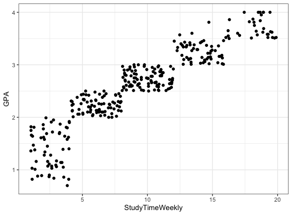
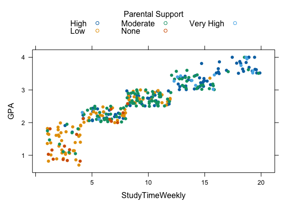
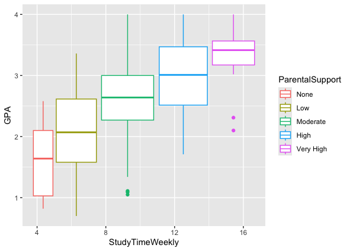

# GPA, Study Time, and Parental Support: A Regression Analysis

## Overview
This project analyzes the relationship between **GPA**, **weekly study hours**, and **parental support levels** using a dataset sourced from [Kaggle](https://www.kaggle.com/datasets/rabieelkharoua/students-performance-dataset). The analysis involves scatter plots, box plots, and regression modeling to explore the impact of study habits and parental involvement on academic performance.

## Dataset
- **Source**: Kaggle - [Students Performance Dataset](Student_Performance_Data_updated.csv)
- **Processed Records**: 318 entries with 10 fields, no missing values.
- **Fields**:
  - `StudentID`: Unique student identifier.
  - `Age`: Age of the student.
  - `Gender`: Gender of the student.
  - `Ethnicity`: Categorized as Caucasian, African American, or Asian.
  - `ParentalEducation`: Levels include None, High School, Some College, Bachelor’s, Higher.
  - `StudyTimeWeekly`: Weekly hours spent studying.
  - `Absences`: Number of school absences in a year.
  - `ParentalSupport`: Levels include None, Low, Moderate, High, Very High.
  - `GPA`: Grade Point Average (0.0 to 4.0 scale).
  - `GradeClass`: Classification based on GPA:
    - A: GPA >= 3.5
    - B: 3.0 <= GPA < 3.5
    - C: 2.5 <= GPA < 3.0
    - D: 2.0 <= GPA < 2.5
    - F: GPA < 2.0

## Objectives
1. Examine the relationship between **GPA** and **weekly study hours**.
2. Investigate the impact of **parental support** on **GPA**.

## Analysis
### 1. Relationship Between GPA and Study Time
- Scatter plot analysis revealed a **positive correlation** between GPA and weekly study hours.
- 

### 2. Impact of Parental Support on GPA
- Scatter plots with colored markers indicate that higher parental support generally corresponds to better GPA performance.
- 
- Box plots reveal:
  - Students with higher parental support tend to study more.
  - High parental support does not guarantee excellent GPA, indicating variability.
  - 

### 3. Regression Analysis: Parental Support and GPA
- Regression model shows:
  - Low support: +0.4314 GPA compared to None.
  - Moderate support: +1.04 GPA compared to None.
  - High support: +1.38 GPA compared to None.
  - Very High support: +1.71 GPA compared to None.
- **Model Insights**:
  - Multiple R-squared: 0.3662 (explains ~36.6% of GPA variability).
  - Significant p-value (< 2.2e-16): Parental support is statistically significant.

### 4. Residual Analysis
- Normality: Residuals approximate normal distribution (W = 0.9874, p < 0.05).
- Autocorrelation: Residuals are independent (p > 0.05).
- Homoscedasticity: Residual variance is stable (p = 0.19181).

### GPA Prediction
Using `StudyTimeWeekly = 15` and `ParentalSupport = High`, the predicted GPA is **2.97**.

## Future Work
- Incorporate additional variables (e.g., age, ethnicity, parental education) to improve the regression model and capture a broader range of GPA influences.

## Conclusion
This project highlights the critical role of parental support and study habits in academic performance. While the model demonstrates significant relationships, future studies can expand on these findings with more comprehensive datasets and variables.

## Acknowledgments
- Dataset: [Students Performance Dataset](Student_Performance_Data_updated.csv)
- Analysis by: Wei-Ting Huang
